
<a href="https://luffm.github.io/Jigsaw-Puzzles/">Jigsaw Puzzles</a>

## Cappella Sistena (Michelangelo)
2025-05-26 

 2014 pieces

## D.C. II - Yume & Otome
2025-02-10 
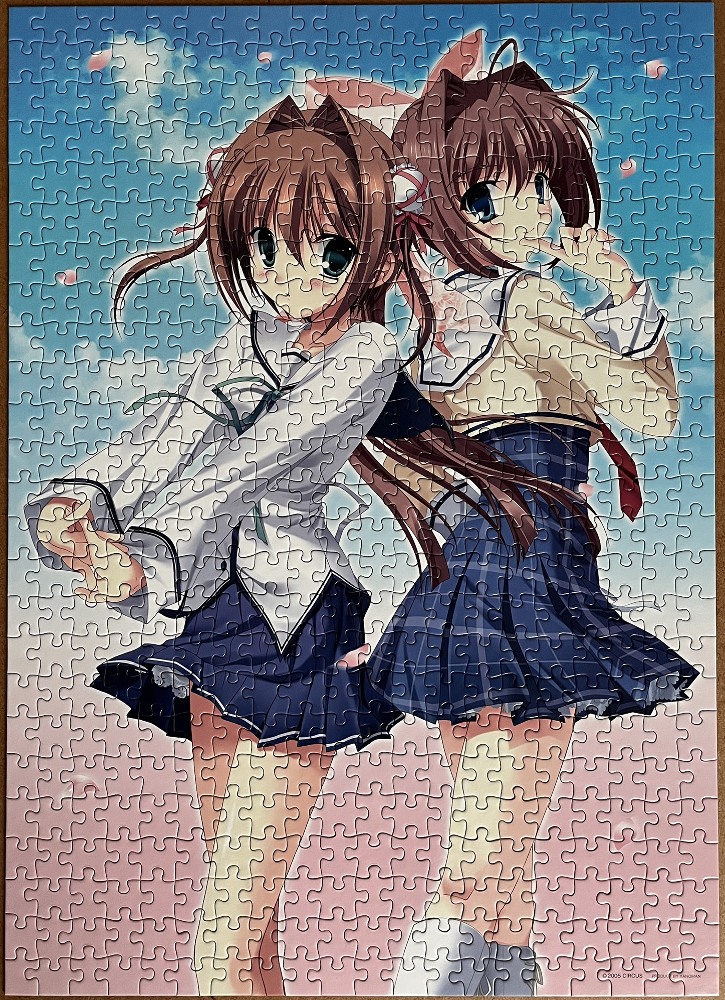
 500 pieces

## The Coronation of Napoleon I (Jacques-Louis David)
2024-07-21 
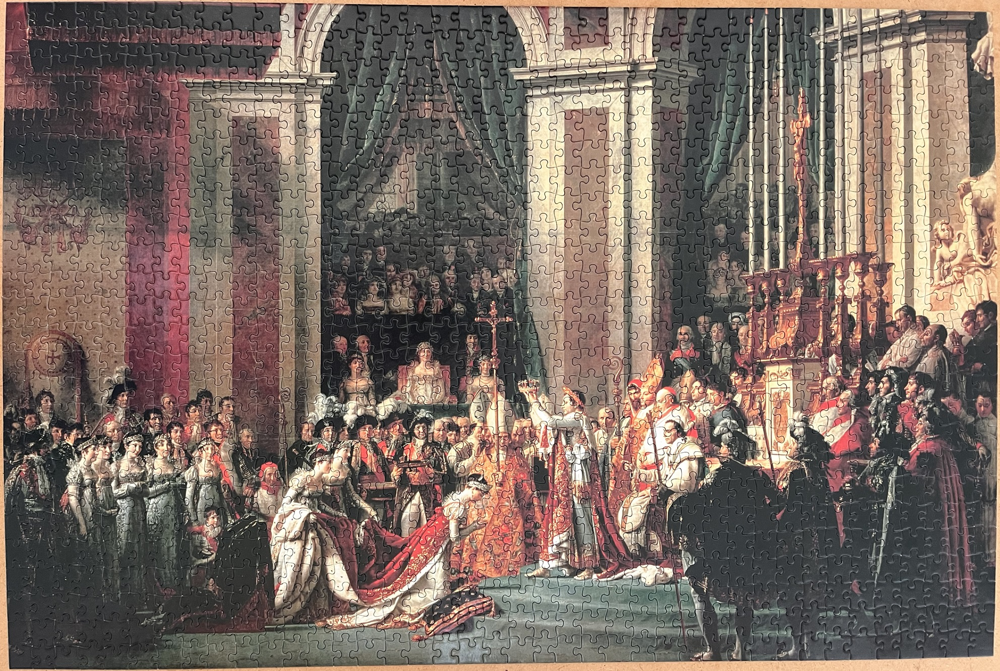
 1000 pieces

## The Chase (Mark Mackay)
2024-07-17 
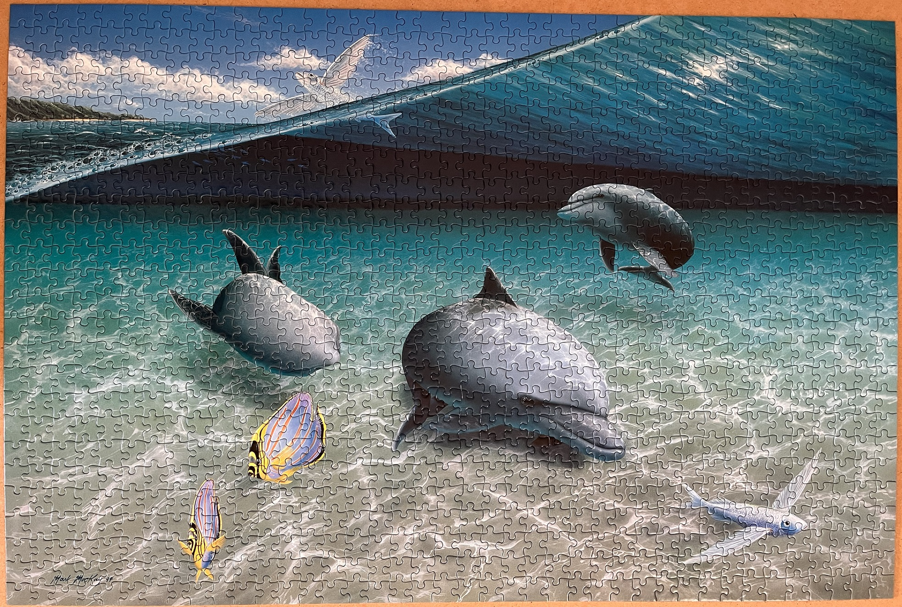
 1000 pieces

## Yamato Departs (Tatsuji Kajita)
2024-04-08 
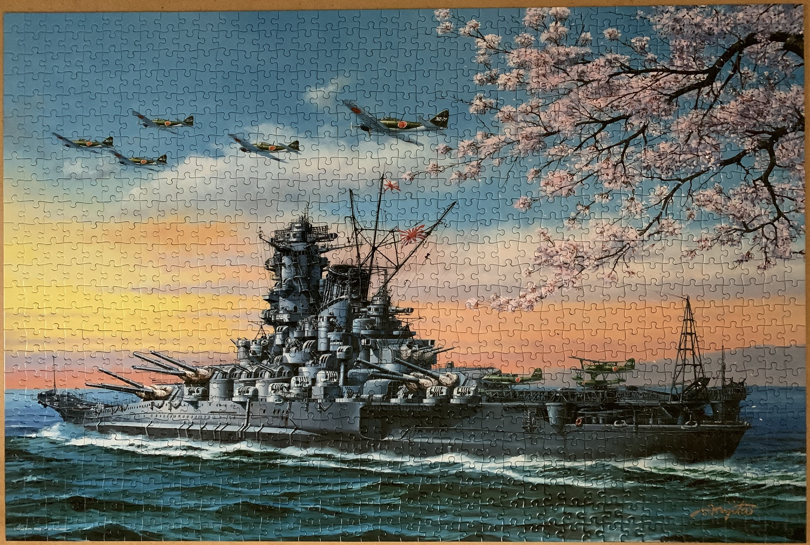
 1000 pieces

## Asuka in the Sky - Evangelion 2.0
2023-12-09 
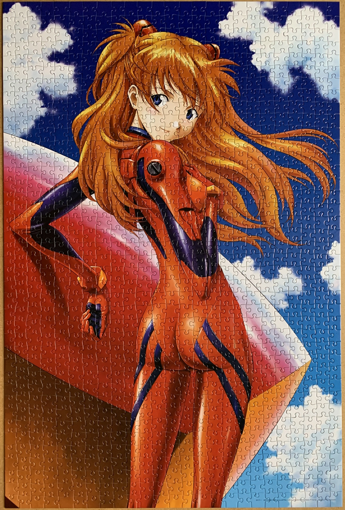
 1000 pieces

## Tower of Babel (Pieter Bruegel the Elder)
2023-11-07 
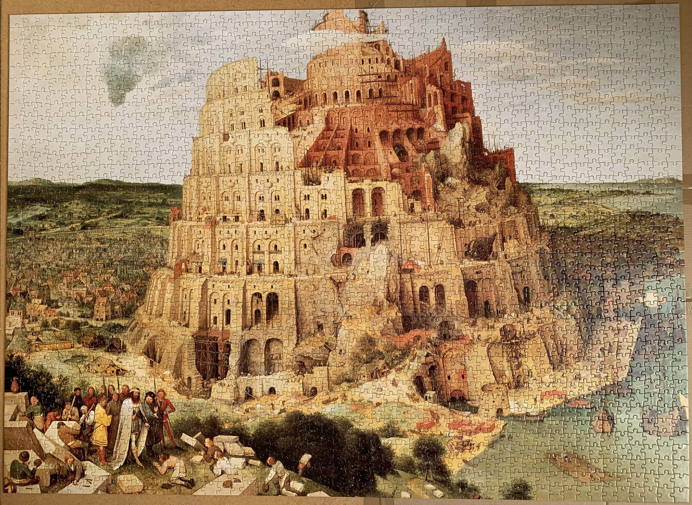
 2014 pieces

## Light on the Dancer (Oshima Rika)
2023-10-01 
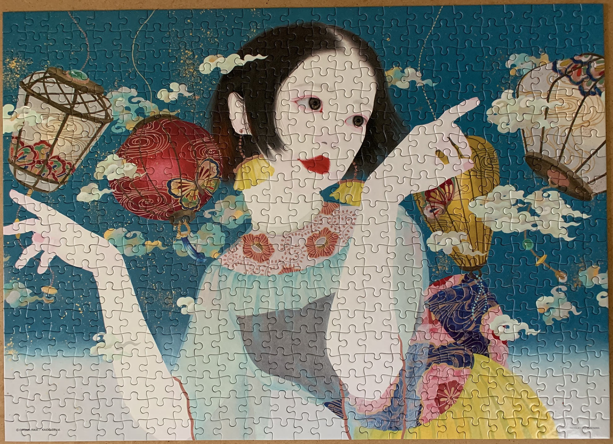
 500 pieces

## Valkyries of White Wings - PUZZLE & DRAGONS (Shiitake)
2023-08-04 
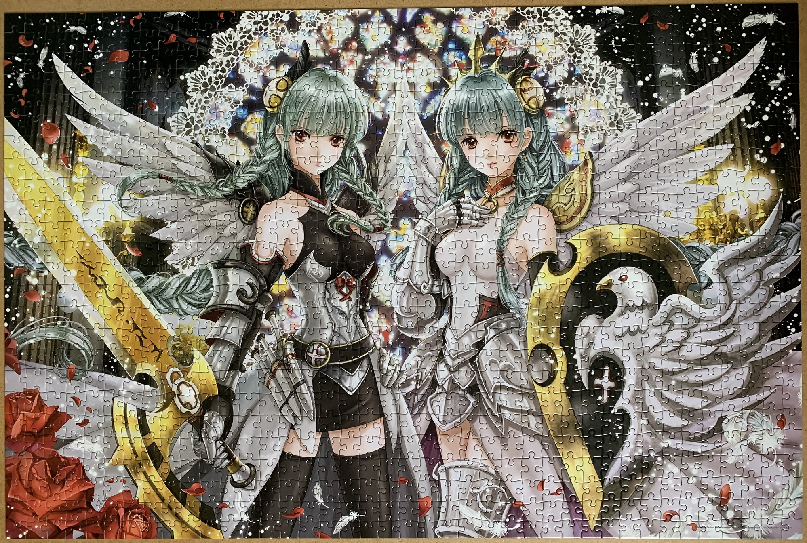
 1000 pieces

## Three Views of the Moon in the Eastern Capital / Nakasu Summer Moon (Utagawa Hiroshige)
2023-03-29 
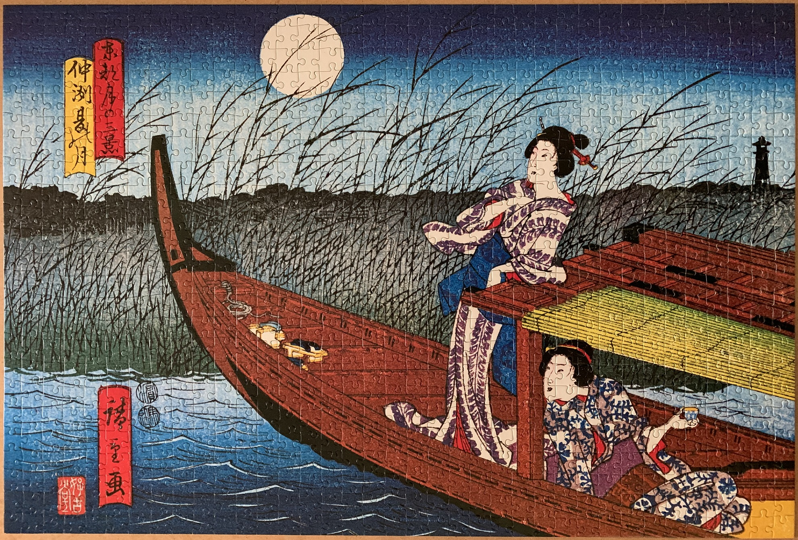
 888 pieces

## Map of the Universe
2022-12-01 
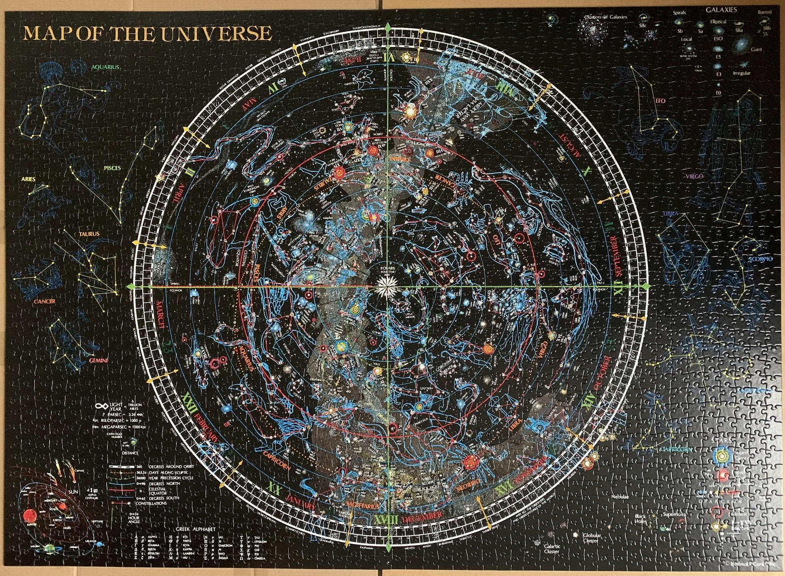
 2014 pieces

## Treasure Ship (Kiichi Okamoto)
2022-05-15 
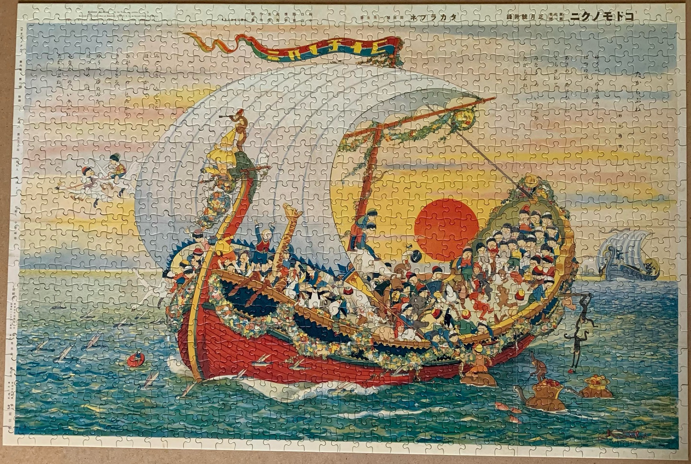
 1000 pieces

## Flowering (Senkō Takahashi)
2022-04-16 
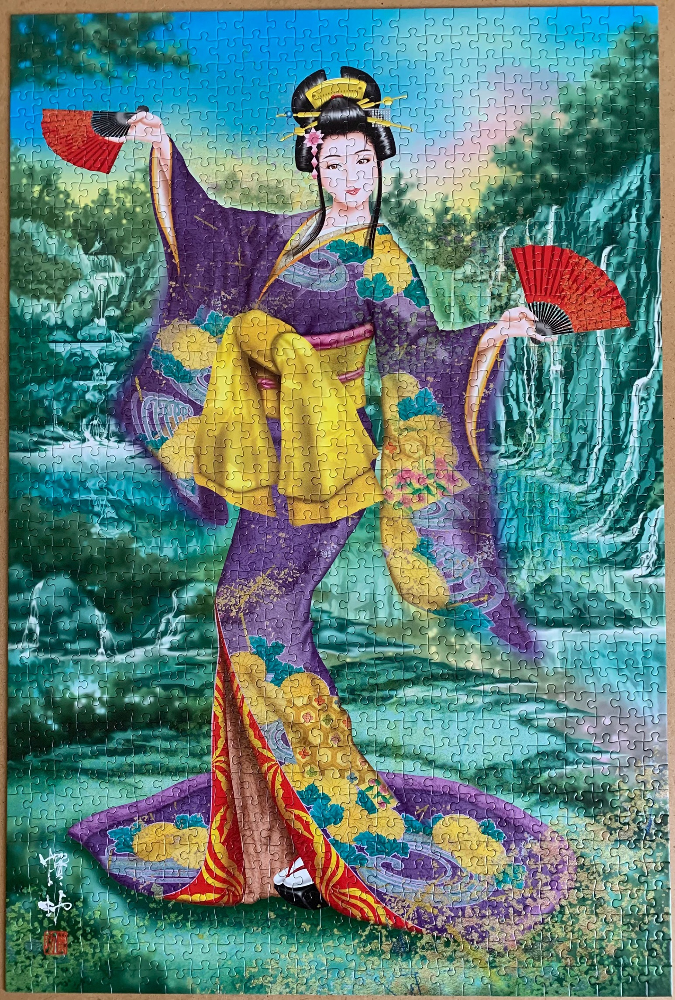
 1000 pieces

<a href="https://luffm.github.io/Jigsaw-Puzzles/">Jigsaw Puzzles</a>

